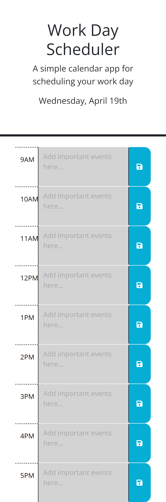

# Work Day Scheduler / Module 05

## Description

This is a simple web app that allows you to enter and save events hour-by-hour throughout a workday. Saved events will persist even if you leave the webpage or refresh, and color styling will indicate how far along you are in the day. If you forget the date, you can always look at the top of the page!

## Usage

Visit https://obelisk477.github.io/work-day-scheduler/ to use the app. The date at the top of the page will update for the day that you are on. At the start of each day, enter in any tasks, events, or meetings that are relevant for each hour, and then hit the corresponding 'Save' icon on the right to save the event. Then, you can leave the page and go about your workday. If you need to check what's happening next, simply re-open the app and check on the items you have saved. The color bars will indicate if any hours have passed (gray), what the current hour is (red), and any upcoming hours and events (green).

## Credits

* MIT License generated by GitHub

## Screenshot

## License

Please refer to the LICENSE in the repo.